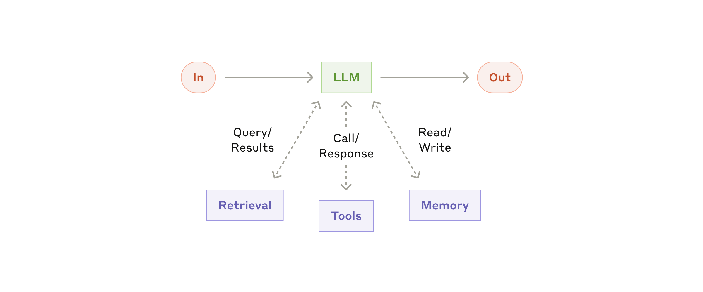
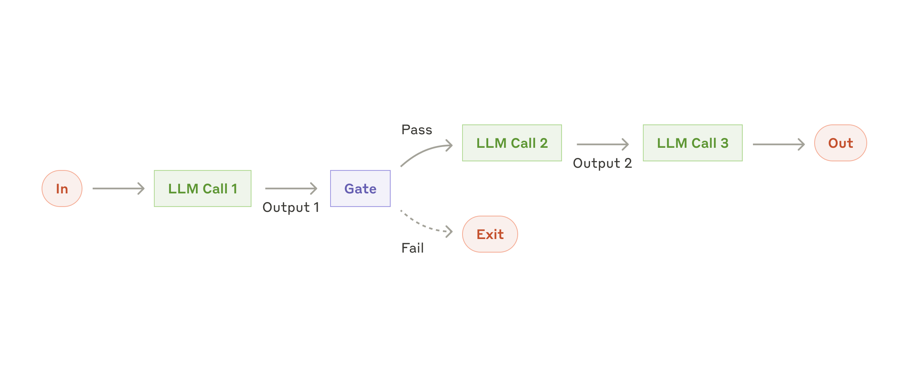
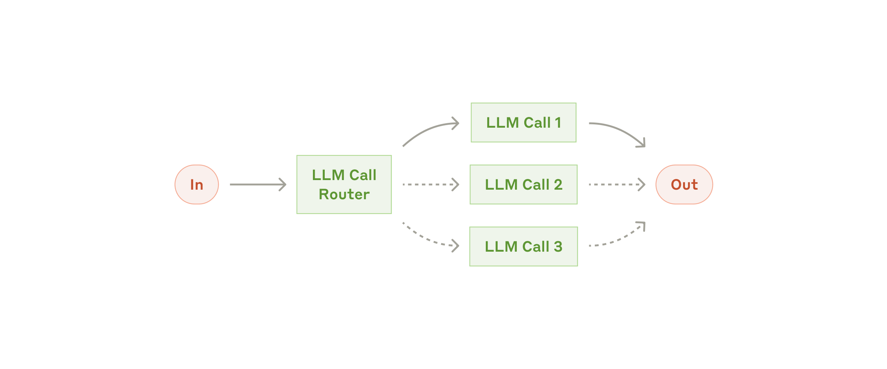
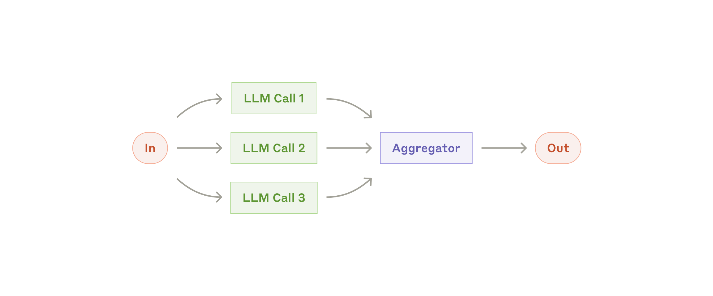
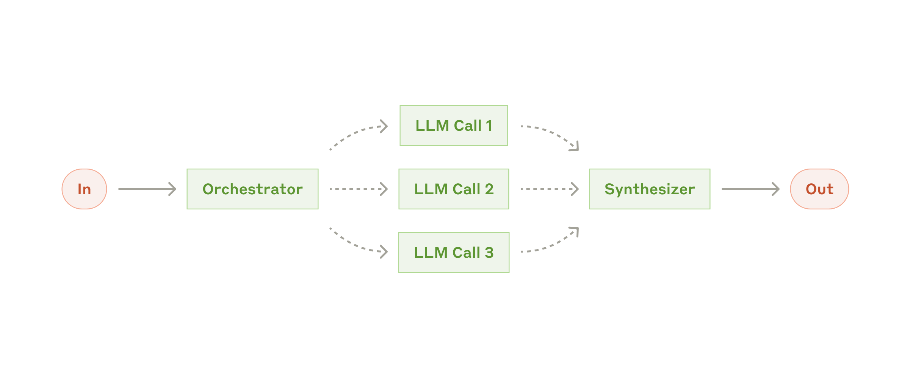
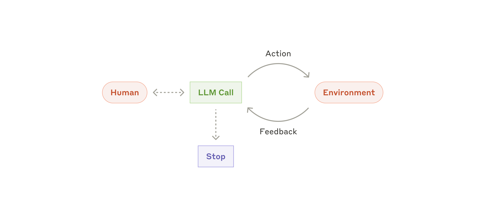
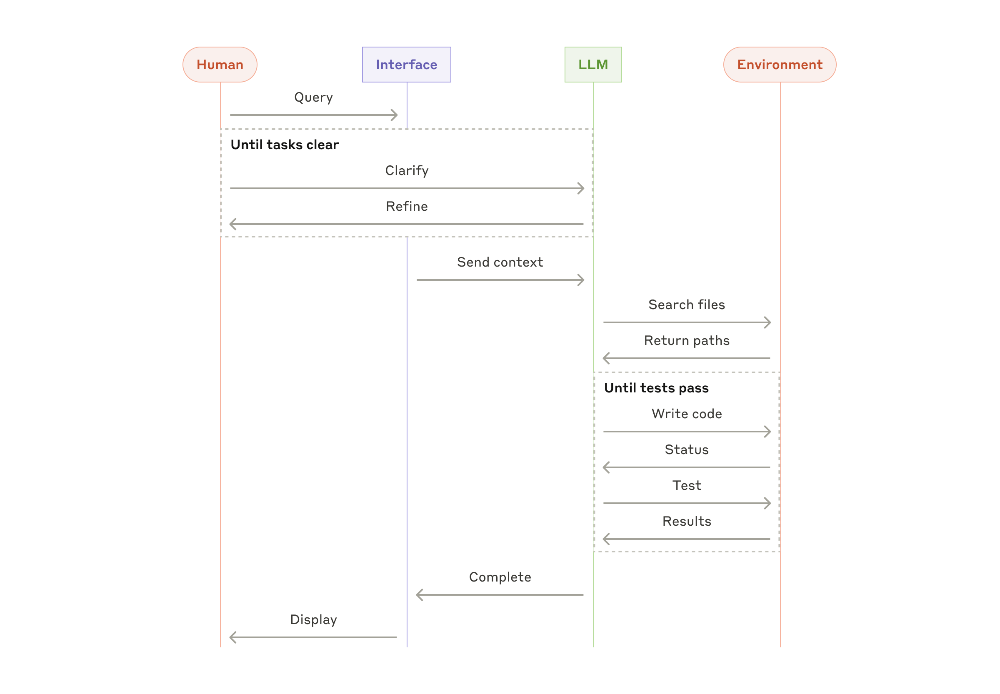

# Xây dựng agent hiệu quả

[Engineering tại Anthropic](https://www.anthropic.com/engineering)

Đăng ngày 19 tháng 12, 2024

Chúng tôi đã làm việc với hàng chục team xây dựng LLM agents trên nhiều ngành. Nhất quán, các triển khai thành công nhất sử dụng các pattern đơn giản, có thể kết hợp thay vì các framework phức tạp.

Trong năm qua, chúng tôi đã làm việc với hàng chục team xây dựng agent mô hình ngôn ngữ lớn (LLM) trên nhiều ngành. Nhất quán, các triển khai thành công nhất không dùng framework phức tạp hay thư viện chuyên biệt. Thay vào đó, họ xây dựng với các pattern đơn giản, có thể kết hợp.

Trong bài viết này, chúng tôi chia sẻ những gì đã học được từ việc làm việc với khách hàng và tự xây dựng agents, đồng thời đưa ra lời khuyên thực tế cho developer về cách xây dựng agent hiệu quả.

## Agent là gì?

"Agent" có thể được định nghĩa theo nhiều cách. Một số khách hàng định nghĩa agent là hệ thống tự trị hoàn toàn hoạt động độc lập trong thời gian dài, sử dụng nhiều công cụ để hoàn thành các tác vụ phức tạp. Số khác dùng thuật ngữ này để mô tả các triển khai mang tính quy định hơn, tuân theo workflow được định nghĩa trước. Tại Anthropic, chúng tôi phân loại tất cả các biến thể này là hệ thống agentic, nhưng phân biệt quan trọng về kiến trúc giữa workflow và agent:

- **Agent** là hệ thống mà LLM chủ động điều khiển quy trình và cách sử dụng công cụ của chính mình, duy trì quyền kiểm soát cách hoàn thành tác vụ.
- **Workflow** là hệ thống mà LLM và công cụ được điều phối qua các đường dẫn code được định nghĩa trước.

Bên dưới, chúng tôi sẽ khám phá chi tiết cả hai loại hệ thống agentic. Trong Phụ lục 1 ("Agents trong thực tế"), chúng tôi mô tả hai lĩnh vực mà khách hàng tìm thấy giá trị đặc biệt khi sử dụng các loại hệ thống này.

## Khi nào (và khi nào không) nên dùng agent

Khi xây dựng ứng dụng với LLM, chúng tôi khuyên nên tìm giải pháp đơn giản nhất có thể, và chỉ tăng độ phức tạp khi cần thiết. Điều này có thể có nghĩa là không xây dựng hệ thống agentic chút nào. Hệ thống agentic thường đánh đổi độ trễ và chi phí để đổi lấy hiệu năng tác vụ tốt hơn, và bạn nên cân nhắc khi nào sự đánh đổi này có ý nghĩa.

Khi cần thêm độ phức tạp, workflow mang lại khả năng dự đoán và nhất quán cho các tác vụ được định nghĩa rõ, trong khi agent là lựa chọn tốt hơn khi cần sự linh hoạt và quyết định do model điều khiển ở quy mô lớn. Tuy nhiên, đối với nhiều ứng dụng, tối ưu hóa các lời gọi LLM đơn lẻ với retrieval và ví dụ in-context thường là đủ.

## Khi nào và cách dùng framework

Có nhiều framework giúp triển khai hệ thống agentic dễ dàng hơn, bao gồm:

- [Vellum](https://www.vellum.ai/), công cụ GUI khác để xây dựng và kiểm thử workflow phức tạp.
- [Rivet](https://rivet.ironcladapp.com/), trình xây dựng workflow LLM kéo-thả; và
- [Strands Agents SDK của AWS](https://strandsagents.com/latest/);
- [Claude Agent SDK](https://platform.claude.com/docs/en/agent-sdk/overview);

Các framework này giúp bắt đầu dễ dàng bằng cách đơn giản hóa các tác vụ cấp thấp chuẩn như gọi LLM, định nghĩa và parse công cụ, và chuỗi các lời gọi. Tuy nhiên, chúng thường tạo thêm các lớp trừu tượng có thể che khuất prompt và phản hồi bên dưới, khiến debug khó hơn. Chúng cũng có thể khiến bạn muốn thêm độ phức tạp khi một thiết lập đơn giản hơn là đủ.

Chúng tôi khuyên developer bắt đầu bằng cách dùng LLM API trực tiếp: nhiều pattern có thể triển khai chỉ trong vài dòng code. Nếu bạn dùng framework, hãy đảm bảo hiểu code bên dưới. Các giả định sai về những gì nằm dưới hood là nguồn lỗi phổ biến từ phía khách hàng.

Xem [cookbook](https://platform.claude.com/cookbook/patterns-agents-basic-workflows) của chúng tôi để biết một số triển khai mẫu.

## Building blocks, workflow và agent

Trong phần này, chúng tôi khám phá các pattern phổ biến cho hệ thống agentic mà chúng tôi đã thấy trong production. Chúng tôi bắt đầu với building block nền tảng—LLM được tăng cường—và tăng dần độ phức tạp, từ workflow kết hợp đơn giản đến agent tự trị.

### Building block: LLM được tăng cường

Building block cơ bản của hệ thống agentic là LLM được tăng cường với các augmentation như retrieval, công cụ và memory. Các model hiện tại của chúng tôi có thể chủ động sử dụng các khả năng này—tạo truy vấn tìm kiếm riêng, chọn công cụ phù hợp, và xác định thông tin cần giữ lại.

Chúng tôi khuyên tập trung vào hai khía cạnh chính của triển khai: điều chỉnh các khả năng này cho use case cụ thể của bạn và đảm bảo chúng cung cấp giao diện dễ dùng, được tài liệu hóa tốt cho LLM. Trong khi có nhiều cách triển khai các augmentation này, một cách tiếp cận là qua [Model Context Protocol](https://www.anthropic.com/news/model-context-protocol) mới phát hành, cho phép developer tích hợp với hệ sinh thái công cụ bên thứ ba đang phát triển với [client implementation](https://modelcontextprotocol.io/tutorials/building-a-client#building-mcp-clients) đơn giản.

Phần còn lại của bài viết, chúng tôi giả định mỗi lời gọi LLM có quyền truy cập các khả năng tăng cường này.

### Workflow: Prompt chaining

Prompt chaining phân rã một tác vụ thành chuỗi các bước, trong đó mỗi lời gọi LLM xử lý output của bước trước. Bạn có thể thêm kiểm tra lập trình (xem "gate" trong sơ đồ bên dưới) ở bất kỳ bước trung gian nào để đảm bảo quy trình vẫn đúng hướng.

**Khi nào dùng workflow này:** Workflow này lý tưởng khi tác vụ có thể phân rã dễ dàng và sạch sẽ thành các subtask cố định. Mục tiêu chính là đánh đổi độ trễ để lấy độ chính xác cao hơn, bằng cách làm mỗi lời gọi LLM thành một tác vụ dễ hơn.

Ví dụ prompt chaining hữu ích:

- Viết dàn ý tài liệu, kiểm tra dàn ý đáp ứng tiêu chí nhất định, rồi viết tài liệu dựa trên dàn ý.
- Tạo nội dung Marketing, rồi dịch sang ngôn ngữ khác.

### Workflow: Routing

Routing phân loại input và hướng nó đến tác vụ follow-up chuyên biệt. Workflow này cho phép tách biệt mối quan tâm và xây dựng prompt chuyên biệt hơn. Không có workflow này, tối ưu cho một loại input có thể làm giảm hiệu năng trên các input khác.

**Khi nào dùng workflow này:** Routing hoạt động tốt cho tác vụ phức tạp có các danh mục rõ ràng được xử lý tốt hơn khi tách riêng, và khi phân loại có thể xử lý chính xác, bằng LLM hoặc model/phép phân loại truyền thống hơn.

Ví dụ routing hữu ích:

- Định tuyến câu hỏi dễ/phổ biến đến model nhỏ, tiết kiệm chi phí như Claude Haiku 4.5 và câu hỏi khó/bất thường đến model mạnh hơn như Claude Sonnet 4.5 để tối ưu hiệu năng tốt nhất.
- Hướng các loại truy vấn hỗ trợ khách hàng khác nhau (câu hỏi chung, yêu cầu hoàn tiền, hỗ trợ kỹ thuật) vào các quy trình, prompt và công cụ downstream khác nhau.

### Workflow: Parallelization

LLM đôi khi có thể làm việc đồng thời trên một tác vụ và output của chúng được tổng hợp theo chương trình. Workflow này, parallelization, thể hiện qua hai biến thể chính:

- **Voting:** Chạy cùng tác vụ nhiều lần để có output đa dạng.
- **Sectioning:** Chia tác vụ thành các subtask độc lập chạy song song.

**Khi nào dùng workflow này:** Parallelization hiệu quả khi các subtask được chia có thể song song hóa để tăng tốc, hoặc khi cần nhiều góc nhìn hoặc thử nghiệm để có kết quả tin cậy cao hơn. Với tác vụ phức tạp có nhiều cân nhắc, LLM thường hoạt động tốt hơn khi mỗi cân nhắc được xử lý bởi một lời gọi LLM riêng, cho phép tập trung vào từng khía cạnh cụ thể.

Ví dụ parallelization hữu ích:

**Sectioning:**

- Tự động hóa evals để đánh giá hiệu năng LLM, trong đó mỗi lời gọi LLM đánh giá khía cạnh khác nhau của hiệu năng model trên prompt cho trước.
- Triển khai guardrails khi một instance model xử lý truy vấn người dùng trong khi instance khác kiểm tra nội dung không phù hợp hoặc yêu cầu. Cách này thường hoạt động tốt hơn so với để cùng một lời gọi LLM xử lý cả guardrails và phản hồi chính.

**Voting:**

- Đánh giá xem nội dung có phù hợp hay không, với nhiều prompt đánh giá các khía cạnh khác nhau hoặc yêu cầu ngưỡng bỏ phiếu khác nhau để cân bằng false positive và negative.
- Rà soát code để tìm lỗ hổng, trong đó nhiều prompt khác nhau rà soát và đánh dấu code nếu tìm thấy vấn đề.

### Workflow: Orchestrator-workers

Trong workflow orchestrator-workers, một LLM trung tâm động phân rã tác vụ, ủy thác cho các LLM worker, và tổng hợp kết quả của họ.

**Khi nào dùng workflow này:** Workflow này phù hợp cho tác vụ phức tạp khi bạn không thể dự đoán subtask cần thiết (ví dụ trong coding, số file cần thay đổi và bản chất thay đổi ở mỗi file có thể phụ thuộc vào tác vụ). Mặc dù tương tự về mặt topo, điểm khác biệt chính so với parallelization là tính linh hoạt—subtask không được định nghĩa trước, mà do orchestrator xác định dựa trên input cụ thể.

Ví dụ orchestrator-workers hữu ích:

- Tác vụ tìm kiếm liên quan thu thập và phân tích thông tin từ nhiều nguồn để tìm thông tin liên quan có thể.
- Sản phẩm coding thực hiện thay đổi phức tạp trên nhiều file mỗi lần.

### Workflow: Evaluator-optimizer

Trong workflow evaluator-optimizer, một lời gọi LLM tạo phản hồi trong khi lời gọi khác cung cấp đánh giá và phản hồi trong vòng lặp.

**Khi nào dùng workflow này:** Workflow này đặc biệt hiệu quả khi có tiêu chí đánh giá rõ ràng, và khi tinh chỉnh lặp lại mang lại giá trị đo lường được. Hai dấu hiệu phù hợp tốt là: thứ nhất, phản hồi LLM có thể cải thiện rõ ràng khi con người diễn đạt phản hồi của họ; và thứ hai, LLM có thể cung cấp phản hồi như vậy. Điều này tương tự quy trình viết lặp mà nhà văn có thể trải qua khi tạo tài liệu hoàn chỉnh.

Ví dụ evaluator-optimizer hữu ích:

- Tác vụ tìm kiếm phức tạp yêu cầu nhiều vòng tìm kiếm và phân tích để thu thập thông tin toàn diện, trong đó evaluator quyết định có cần tìm kiếm thêm hay không.
- Dịch văn học có sắc thái mà LLM dịch có thể không nắm bắt ban đầu, nhưng evaluator LLM có thể đưa ra phê bình hữu ích.

### Agents

Agent đang xuất hiện trong production khi LLM trưởng thành về các khả năng chính—hiểu input phức tạp, tham gia lập luận và lập kế hoạch, sử dụng công cụ đáng tin cậy, và phục hồi từ lỗi. Agent bắt đầu công việc với lệnh từ hoặc thảo luận tương tác với người dùng. Khi tác vụ rõ ràng, agent lập kế hoạch và hoạt động độc lập, có thể quay lại với con người để lấy thêm thông tin hoặc phán đoán. Trong quá trình thực thi, điều quan trọng là agent có được "ground truth" từ môi trường ở mỗi bước (như kết quả gọi công cụ hoặc thực thi code) để đánh giá tiến độ. Agent sau đó có thể tạm dừng để lấy phản hồi con người tại các checkpoint hoặc khi gặp blocker. Tác vụ thường kết thúc khi hoàn thành, nhưng cũng phổ biến khi bao gồm điều kiện dừng (như số lần lặp tối đa) để duy trì kiểm soát.

Agent có thể xử lý tác vụ tinh vi, nhưng triển khai của chúng thường đơn giản. Chúng thường chỉ là LLM sử dụng công cụ dựa trên phản hồi môi trường trong vòng lặp. Do đó điều quan trọng là thiết kế bộ công cụ và tài liệu của chúng rõ ràng và chu đáo. Chúng tôi mở rộng best practice cho phát triển công cụ trong Phụ lục 2 ("Prompt Engineering cho công cụ của bạn").

**Khi nào dùng agent:** Agent có thể dùng cho vấn đề mở khi khó hoặc không thể dự đoán số bước cần thiết, và khi bạn không thể hardcode đường dẫn cố định. LLM có thể hoạt động trong nhiều lượt, và bạn phải có mức độ tin tưởng nhất định vào quyết định của nó. Tính tự trị của agent khiến chúng lý tưởng để mở rộng tác vụ trong môi trường tin cậy.

Bản chất tự trị của agent đồng nghĩa chi phí cao hơn, và tiềm ẩn lỗi tích lũy. Chúng tôi khuyên kiểm thử kỹ trong môi trường sandbox, cùng với guardrails phù hợp.

Ví dụ agent hữu ích:

Các ví dụ sau từ triển khai của chúng tôi:

- [Triển khai tham chiếu "computer use"](https://github.com/anthropics/anthropic-quickstarts/tree/main/computer-use-demo) của chúng tôi, nơi Claude sử dụng máy tính để hoàn thành tác vụ.
- Agent coding để giải quyết [tác vụ SWE-bench](https://www.anthropic.com/research/swe-bench-sonnet), liên quan chỉnh sửa nhiều file dựa trên mô tả tác vụ;

## Kết hợp và tùy chỉnh các pattern

Các building block này không mang tính quy định. Chúng là các pattern phổ biến mà developer có thể định hình và kết hợp cho các use case khác nhau. Chìa khóa thành công, như với mọi tính năng LLM, là đo lường hiệu năng và lặp trên triển khai. Nhắc lại: bạn chỉ nên cân nhắc thêm độ phức tạp khi nó cải thiện kết quả rõ ràng.

## Tóm tắt

Thành công trong không gian LLM không phải về xây dựng hệ thống tinh vi nhất. Đó là về xây dựng đúng hệ thống cho nhu cầu của bạn. Bắt đầu với prompt đơn giản, tối ưu chúng với đánh giá toàn diện, và thêm hệ thống agentic nhiều bước chỉ khi giải pháp đơn giản hơn không đủ.

Khi triển khai agent, chúng tôi cố gắng tuân theo ba nguyên tắc cốt lõi:

1. Chế tác cẩn thận giao diện agent-máy tính (ACI) qua tài liệu và kiểm thử công cụ kỹ lưỡng.
2. Ưu tiên minh bạch bằng cách hiển thị rõ ràng các bước lập kế hoạch của agent.
3. Duy trì sự đơn giản trong thiết kế agent của bạn.

Framework có thể giúp bắt đầu nhanh, nhưng đừng ngần ngại giảm các lớp trừu tượng và xây dựng với các thành phần cơ bản khi chuyển sang production. Bằng cách tuân theo các nguyên tắc này, bạn có thể tạo agent không chỉ mạnh mẽ mà còn đáng tin cậy, dễ bảo trì và được người dùng tin tưởng.

### Lời cảm ơn

Viết bởi Erik Schluntz và Barry Zhang. Công việc này dựa trên kinh nghiệm xây dựng agent tại Anthropic và những insight quý báu từ khách hàng, mà chúng tôi vô cùng biết ơn.

## Phụ lục 1: Agents trong thực tế

Công việc với khách hàng đã tiết lộ hai ứng dụng đặc biệt hứa hẹn cho AI agent thể hiện giá trị thực tế của các pattern đã thảo luận. Cả hai ứng dụng minh họa cách agent mang lại giá trị nhất cho tác vụ vừa cần hội thoại vừa cần hành động, có tiêu chí thành công rõ ràng, cho phép vòng phản hồi, và tích hợp giám sát con người có ý nghĩa.

### A. Hỗ trợ khách hàng

Hỗ trợ khách hàng kết hợp giao diện chatbot quen thuộc với khả năng tăng cường qua tích hợp công cụ. Đây là fit tự nhiên cho agent mở hơn vì:

- Thành công có thể đo lường rõ ràng qua resolution do người dùng định nghĩa.
- Các hành động như hoàn tiền hoặc cập nhật ticket có thể xử lý theo chương trình; và
- Công cụ có thể tích hợp để kéo dữ liệu khách hàng, lịch sử đơn hàng và bài viết knowledge base;
- Tương tác hỗ trợ tự nhiên theo luồng hội thoại trong khi cần truy cập thông tin và hành động bên ngoài;

Một số công ty đã chứng minh tính khả thi của cách tiếp cận này qua mô hình định giá theo sử dụng chỉ tính phí cho resolution thành công, thể hiện sự tin tưởng vào hiệu quả agent của họ.

### B. Agent coding

Không gian phát triển phần mềm đã cho thấy tiềm năng đáng chú ý cho tính năng LLM, với khả năng phát triển từ hoàn thành code đến giải quyết vấn đề tự trị. Agent đặc biệt hiệu quả vì:

- Chất lượng output có thể đo lường khách quan.
- Không gian vấn đề được định nghĩa rõ và có cấu trúc; và
- Agent có thể lặp trên giải pháp sử dụng kết quả test làm phản hồi;
- Giải pháp code có thể xác minh qua test tự động;

Trong triển khai của chúng tôi, agent hiện có thể giải quyết issue GitHub thực trong benchmark [SWE-bench Verified](https://www.anthropic.com/research/swe-bench-sonnet) chỉ dựa trên mô tả pull request. Tuy nhiên, trong khi test tự động giúp xác minh chức năng, rà soát con người vẫn quan trọng để đảm bảo giải pháp phù hợp với yêu cầu hệ thống rộng hơn.

## Phụ lục 2: Prompt engineering cho công cụ của bạn

Dù bạn đang xây dựng hệ thống agentic nào, công cụ có thể là phần quan trọng của agent. [Công cụ](https://www.anthropic.com/news/tool-use-ga) cho phép Claude tương tác với dịch vụ và API bên ngoài bằng cách chỉ định cấu trúc và định nghĩa chính xác trong API của chúng tôi. Khi Claude phản hồi, nó sẽ bao gồm [tool use block](https://docs.anthropic.com/en/docs/build-with-claude/tool-use#example-api-response-with-a-tool-use-content-block) trong phản hồi API nếu dự định gọi công cụ. Định nghĩa và đặc tả công cụ nên được chú ý prompt engineering nhiều như prompt tổng thể. Trong phụ lục ngắn này, chúng tôi mô tả cách prompt engineer công cụ của bạn.

Thường có nhiều cách chỉ định cùng một hành động. Ví dụ, bạn có thể chỉ định chỉnh sửa file bằng cách viết diff, hoặc viết lại toàn bộ file. Với output có cấu trúc, bạn có thể trả về code trong markdown hoặc trong JSON. Trong kỹ thuật phần mềm, sự khác biệt như vậy là cosmetic và có thể chuyển đổi lossless từ cái này sang cái kia. Tuy nhiên, một số format khó viết hơn nhiều cho LLM. Viết diff yêu cầu biết bao nhiêu dòng đang thay đổi trong chunk header trước khi viết code mới. Viết code trong JSON (so với markdown) yêu cầu escape thêm newline và dấu ngoặc kép.

Gợi ý của chúng tôi khi quyết định format công cụ:

- Đảm bảo không có "overhead" format như phải giữ đếm chính xác hàng ngàn dòng code, hoặc string-escaping bất kỳ code nào nó viết.
- Giữ format gần với những gì model đã thấy xuất hiện tự nhiên trong văn bản trên internet.
- Cho model đủ token để "suy nghĩ" trước khi viết vào ngõ cụt.

Một quy tắc ngón tay cái là nghĩ về bao nhiêu nỗ lực dành cho giao diện người-máy (HCI), và lên kế hoạch đầu tư nỗ lực tương đương để tạo giao diện agent-máy (ACI) tốt. Dưới đây là một số suy nghĩ:

- [Poka-yoke](https://en.wikipedia.org/wiki/Poka-yoke) công cụ của bạn. Thay đổi tham số để khó mắc lỗi hơn.
- Kiểm thử cách model sử dụng công cụ: Chạy nhiều input mẫu trong [workbench](https://console.anthropic.com/workbench) của chúng tôi để xem model mắc lỗi gì, và lặp.
- Làm thế nào thay đổi tên tham số hoặc mô tả để mọi thứ rõ ràng hơn? Nghĩ như viết docstring tuyệt vời cho developer mới trong team. Điều này đặc biệt quan trọng khi dùng nhiều công cụ tương tự.
- Đặt mình vào vị trí model. Có rõ ràng cách dùng công cụ này dựa trên mô tả và tham số không, hay bạn cần suy nghĩ kỹ? Nếu vậy, có thể cũng đúng với model. Định nghĩa công cụ tốt thường bao gồm ví dụ sử dụng, edge case, yêu cầu format input, và ranh giới rõ ràng với công cụ khác.

Khi xây dựng agent cho [SWE-bench](https://www.anthropic.com/research/swe-bench-sonnet), chúng tôi thực sự dành nhiều thời gian tối ưu công cụ hơn prompt tổng thể. Ví dụ, chúng tôi phát hiện model mắc lỗi với công cụ dùng relative filepath sau khi agent đã di chuyển ra khỏi thư mục root. Để sửa, chúng tôi thay đổi công cụ luôn yêu cầu absolute filepath—và chúng tôi thấy model dùng phương pháp này hoàn hảo.
