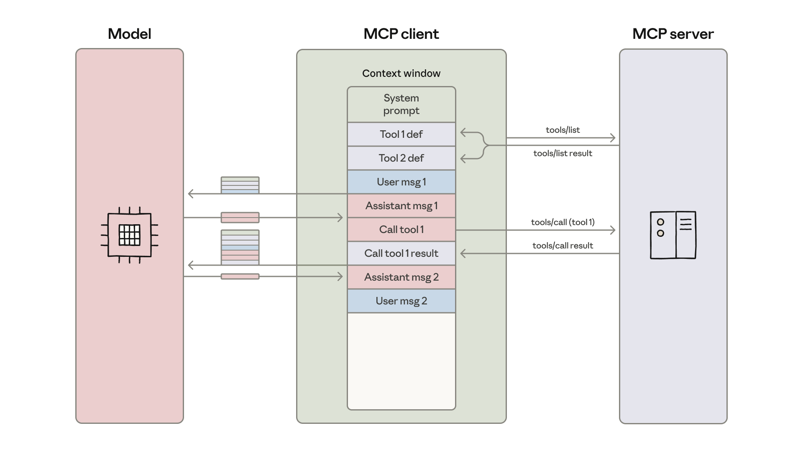

# Thực thi code với MCP: Xây dựng agent hiệu quả hơn

[Engineering tại Anthropic](https://www.anthropic.com/engineering)

Đăng ngày 4 tháng 11, 2025

Gọi công cụ trực tiếp tiêu tốn context cho mỗi định nghĩa và kết quả. Agent mở rộng tốt hơn bằng cách viết code để gọi công cụ thay vì gọi trực tiếp. Đây là cách hoạt động với MCP.

[Model Context Protocol (MCP)](https://modelcontextprotocol.io/) là chuẩn mở để kết nối AI agent với hệ thống bên ngoài. Kết nối agent với công cụ và dữ liệu truyền thống yêu cầu tích hợp tùy chỉnh cho mỗi cặp, tạo ra sự phân mảnh và nỗ lực trùng lặp khiến khó mở rộng hệ thống thực sự kết nối. MCP cung cấp giao thức phổ quát—developer triển khai MCP một lần trong agent và mở khóa toàn bộ hệ sinh thái tích hợp.

Kể từ khi ra mắt MCP vào tháng 11/2024, việc áp dụng đã nhanh chóng: cộng đồng đã xây dựng hàng ngàn [MCP server](https://github.com/modelcontextprotocol/servers), [SDK](https://modelcontextprotocol.io/docs/sdk) có sẵn cho tất cả ngôn ngữ lập trình chính, và ngành công nghiệp đã chấp nhận MCP là chuẩn de-facto để kết nối agent với công cụ và dữ liệu.

Ngày nay developer thường xây dựng agent với quyền truy cập hàng trăm hoặc hàng ngàn công cụ trên hàng chục MCP server. Tuy nhiên, khi số lượng công cụ kết nối tăng lên, việc tải tất cả định nghĩa công cụ trước và truyền kết quả trung gian qua context window làm chậm agent và tăng chi phí.

Trong blog này chúng ta sẽ khám phá cách thực thi code có thể cho phép agent tương tác với MCP server hiệu quả hơn, xử lý nhiều công cụ hơn trong khi dùng ít token hơn.

## Tiêu thụ token quá mức từ công cụ làm agent kém hiệu quả

Khi việc sử dụng MCP mở rộng, có hai pattern phổ biến có thể tăng chi phí và độ trễ của agent:

1. Kết quả công cụ trung gian tiêu thụ thêm token.
2. Định nghĩa công cụ làm quá tải context window;

### 1. Định nghĩa công cụ làm quá tải context window

Hầu hết MCP client tải tất cả định nghĩa công cụ trước trực tiếp vào context, hiển thị chúng cho model bằng cú pháp gọi công cụ trực tiếp. Các định nghĩa công cụ có thể trông như:

```
gdrive.getDocument
     Description: Retrieves a document from Google Drive
     Parameters:
                documentId (required, string): The ID of the document to retrieve
                fields (optional, string): Specific fields to return
     Returns: Document object with title, body content, metadata, permissions, etc.
```

```
salesforce.updateRecord
    Description: Updates a record in Salesforce
    Parameters:
               objectType (required, string): Type of Salesforce object (Lead, Contact,      Account, etc.)
               recordId (required, string): The ID of the record to update
               data (required, object): Fields to update with their new values
     Returns: Updated record object with confirmation
```

Mô tả công cụ chiếm nhiều không gian context window hơn, tăng thời gian phản hồi và chi phí. Trong trường hợp agent được kết nối với hàng ngàn công cụ, chúng sẽ cần xử lý hàng trăm ngàn token trước khi đọc một yêu cầu.

### 2. Kết quả công cụ trung gian tiêu thụ thêm token

Hầu hết MCP client cho phép model gọi trực tiếp công cụ MCP. Ví dụ, bạn có thể yêu cầu agent: "Tải bài ghi cuộc họp của tôi từ Google Drive và đính kèm vào lead Salesforce."

Model sẽ thực hiện các lời gọi như:

```
TOOL CALL: gdrive.getDocument(documentId: "abc123")
        → returns "Discussed Q4 goals...\n[full transcript text]"
           (loaded into model context)

TOOL CALL: salesforce.updateRecord(
			objectType: "SalesMeeting",
			recordId: "00Q5f000001abcXYZ",
  			data: { "Notes": "Discussed Q4 goals...\n[full transcript text written out]" }
		)
		(model needs to write entire transcript into context again)
```

Mọi kết quả trung gian phải đi qua model. Trong ví dụ này, toàn bộ bài ghi cuộc gọi chảy qua hai lần. Với cuộc họp bán hàng 2 giờ, điều đó có thể có nghĩa xử lý thêm 50.000 token. Tài liệu lớn hơn thậm chí có thể vượt giới hạn context window, phá vỡ workflow.

Với tài liệu lớn hoặc cấu trúc dữ liệu phức tạp, model có thể dễ mắc lỗi hơn khi sao chép dữ liệu giữa các lời gọi công cụ.



## Thực thi code với MCP cải thiện hiệu quả context

Với môi trường thực thi code ngày càng phổ biến cho agent, một giải pháp là trình bày MCP server như code API thay vì gọi công cụ trực tiếp. Agent sau đó có thể viết code để tương tác với MCP server. Cách tiếp cận này giải quyết cả hai thách thức: agent có thể chỉ tải công cụ cần thiết và xử lý dữ liệu trong môi trường thực thi trước khi truyền kết quả về model.

Có nhiều cách làm điều này. Một cách tiếp cận là tạo cây file của tất cả công cụ có sẵn từ MCP server đã kết nối. Đây là triển khai dùng TypeScript:

```
servers
├── google-drive
│   ├── getDocument.ts
│   ├── ... (other tools)
│   └── index.ts
├── salesforce
│   ├── updateRecord.ts
│   ├── ... (other tools)
│   └── index.ts
└── ... (other servers)
```

Sau đó mỗi công cụ tương ứng với một file, ví dụ:

```
// ./servers/google-drive/getDocument.ts
import { callMCPTool } from "../../../client.js";

interface GetDocumentInput {
  documentId: string;
}

interface GetDocumentResponse {
  content: string;
}

/* Read a document from Google Drive */
export async function getDocument(input: GetDocumentInput): Promise<GetDocumentResponse> {
  return callMCPTool<GetDocumentResponse>('google_drive__get_document', input);
}
```

Ví dụ Google Drive sang Salesforce ở trên trở thành code:

```
// Read transcript from Google Docs and add to Salesforce prospect
import * as gdrive from './servers/google-drive';
import * as salesforce from './servers/salesforce';

const transcript = (await gdrive.getDocument({ documentId: 'abc123' })).content;
await salesforce.updateRecord({
  objectType: 'SalesMeeting',
  recordId: '00Q5f000001abcXYZ',
  data: { Notes: transcript }
});
```

Agent khám phá công cụ bằng cách duyệt filesystem: liệt kê thư mục `./servers/` để tìm server có sẵn (như `google-drive` và `salesforce`), sau đó đọc các file công cụ cụ thể cần thiết (như `getDocument.ts` và `updateRecord.ts`) để hiểu giao diện của mỗi công cụ. Điều này cho phép agent chỉ tải những định nghĩa cần cho tác vụ hiện tại. Điều này giảm token usage từ 150.000 token xuống 2.000 token—tiết kiệm thời gian và chi phí 98,7%.

Cloudflare [đã công bố phát hiện tương tự](https://blog.cloudflare.com/code-mode/), gọi thực thi code với MCP là "Code Mode". Insight cốt lõi giống nhau: LLM giỏi viết code và developer nên tận dụng điểm mạnh này để xây dựng agent tương tác với MCP server hiệu quả hơn.

## Lợi ích của thực thi code với MCP

Thực thi code với MCP cho phép agent sử dụng context hiệu quả hơn bằng cách tải công cụ theo nhu cầu, lọc dữ liệu trước khi đến model, và thực thi logic phức tạp trong một bước. Cũng có lợi ích bảo mật và quản lý trạng thái khi dùng cách tiếp cận này.

### Progressive disclosure

Model rất giỏi điều hướng filesystem. Trình bày công cụ như code trên filesystem cho phép model đọc định nghĩa công cụ theo nhu cầu, thay vì đọc tất cả trước.

Hoặc, có thể thêm công cụ `search_tools` vào server để tìm định nghĩa liên quan. Ví dụ, khi làm việc với server Salesforce giả định ở trên, agent tìm kiếm "salesforce" và chỉ tải những công cụ cần cho tác vụ hiện tại. Bao gồm tham số mức độ chi tiết trong công cụ `search_tools` cho phép agent chọn mức độ chi tiết cần thiết (như chỉ tên, tên và mô tả, hoặc định nghĩa đầy đủ với schema) cũng giúp agent tiết kiệm context và tìm công cụ hiệu quả.

### Kết quả công cụ tiết kiệm context

Khi làm việc với dataset lớn, agent có thể lọc và transform kết quả trong code trước khi trả về. Ví dụ fetch bảng tính 10.000 dòng:

```
// Without code execution - all rows flow through context
TOOL CALL: gdrive.getSheet(sheetId: 'abc123')
        → returns 10,000 rows in context to filter manually

// With code execution - filter in the execution environment
const allRows = await gdrive.getSheet({ sheetId: 'abc123' });
const pendingOrders = allRows.filter(row => 
  row["Status"] === 'pending'
);
console.log(`Found ${pendingOrders.length} pending orders`);
console.log(pendingOrders.slice(0, 5)); // Only log first 5 for review
```

Agent thấy 5 dòng thay vì 10.000. Pattern tương tự hoạt động cho aggregation, join qua nhiều nguồn dữ liệu, hoặc trích xuất trường cụ thể—tất cả không làm phình context window.

#### Luồng điều khiển mạnh hơn và tiết kiệm context

Vòng lặp, điều kiện và xử lý lỗi có thể thực hiện với pattern code quen thuộc thay vì chuỗi các lời gọi công cụ riêng lẻ. Ví dụ, nếu bạn cần thông báo deployment trong Slack, agent có thể viết:

```
let found = false;
while (!found) {
  const messages = await slack.getChannelHistory({ channel: 'C123456' });
  found = messages.some(m => m.text.includes('deployment complete'));
  if (!found) await new Promise(r => setTimeout(r, 5000));
}
console.log('Deployment notification received');
```

Cách tiếp cận này hiệu quả hơn so với xen kẽ giữa lời gọi công cụ MCP và lệnh sleep qua vòng lặp agent.

Ngoài ra, việc có thể viết ra cây điều kiện được thực thi cũng tiết kiệm độ trễ "time to first token": thay vì phải đợi model đánh giá câu lệnh if, agent có thể để môi trường thực thi code làm điều đó.

### Thao tác bảo vệ quyền riêng tư

Khi agent dùng thực thi code với MCP, kết quả trung gian mặc định ở trong môi trường thực thi. Như vậy agent chỉ thấy những gì bạn log hoặc return rõ ràng, nghĩa là dữ liệu bạn không muốn chia sẻ với model có thể chảy qua workflow mà không bao giờ vào context của model.

Với workload nhạy cảm hơn, agent harness có thể tokenize dữ liệu nhạy cảm tự động. Ví dụ, tưởng tượng bạn cần import thông tin liên hệ khách hàng từ bảng tính vào Salesforce. Agent viết:

```
const sheet = await gdrive.getSheet({ sheetId: 'abc123' });
for (const row of sheet.rows) {
  await salesforce.updateRecord({
    objectType: 'Lead',
    recordId: row.salesforceId,
    data: { 
      Email: row.email,
      Phone: row.phone,
      Name: row.name
    }
  });
}
console.log(`Updated ${sheet.rows.length} leads`);
```

MCP client chặn dữ liệu và tokenize PII trước khi đến model:

```
// What the agent would see, if it logged the sheet.rows:
[
  { salesforceId: '00Q...', email: '[EMAIL_1]', phone: '[PHONE_1]', name: '[NAME_1]' },
  { salesforceId: '00Q...', email: '[EMAIL_2]', phone: '[PHONE_2]', name: '[NAME_2]' },
  ...
]
```

Sau đó, khi dữ liệu được chia sẻ trong lời gọi công cụ MCP khác, nó được untokenize qua lookup trong MCP client. Địa chỉ email, số điện thoại và tên thật chảy từ Google Sheets sang Salesforce, nhưng không bao giờ qua model. Điều này ngăn agent vô tình log hoặc xử lý dữ liệu nhạy cảm. Bạn cũng có thể dùng điều này để định nghĩa quy tắc bảo mật xác định, chọn where dữ liệu có thể chảy đến và từ đâu.

### Duy trì trạng thái và skills

Thực thi code với quyền truy cập filesystem cho phép agent duy trì trạng thái qua các thao tác. Agent có thể ghi kết quả trung gian vào file, cho phép tiếp tục công việc và theo dõi tiến độ:

```
const leads = await salesforce.query({ 
  query: 'SELECT Id, Email FROM Lead LIMIT 1000' 
});
const csvData = leads.map(l => `${l.Id},${l.Email}`).join('\n');
await fs.writeFile('./workspace/leads.csv', csvData);

// Later execution picks up where it left off
const saved = await fs.readFile('./workspace/leads.csv', 'utf-8');
```

Agent cũng có thể lưu code của chính mình dưới dạng hàm tái sử dụng. Một khi agent phát triển code hoạt động cho một tác vụ, nó có thể lưu triển khai đó để dùng sau:

```
// In ./skills/save-sheet-as-csv.ts
import * as gdrive from './servers/google-drive';
export async function saveSheetAsCsv(sheetId: string) {
  const data = await gdrive.getSheet({ sheetId });
  const csv = data.map(row => row.join(',')).join('\n');
  await fs.writeFile(`./workspace/sheet-${sheetId}.csv`, csv);
  return `./workspace/sheet-${sheetId}.csv`;
}

// Later, in any agent execution:
import { saveSheetAsCsv } from './skills/save-sheet-as-csv';
const csvPath = await saveSheetAsCsv('abc123');
```

Điều này gắn chặt với khái niệm [Skills](https://docs.claude.com/en/docs/agents-and-tools/agent-skills/overview), thư mục hướng dẫn, script và tài nguyên tái sử dụng cho model để cải thiện hiệu năng trên tác vụ chuyên biệt. Thêm file SKILL.md vào các hàm đã lưu này tạo skill có cấu trúc mà model có thể tham chiếu và sử dụng. Theo thời gian, điều này cho phép agent xây dựng hộp công cụ khả năng cấp cao hơn, phát triển scaffolding cần thiết để hoạt động hiệu quả nhất.

Lưu ý rằng thực thi code đưa ra độ phức tạp riêng. Chạy code do agent tạo yêu cầu môi trường thực thi an toàn với [sandboxing](https://www.anthropic.com/engineering/claude-code-sandboxing), giới hạn tài nguyên và giám sát phù hợp. Các yêu cầu hạ tầng này thêm chi phí vận hành và cân nhắc bảo mật mà gọi công cụ trực tiếp không có. Lợi ích của thực thi code—giảm chi phí token, độ trễ thấp hơn, và cải thiện composition công cụ—nên được cân nhắc với các chi phí triển khai này.

## Tóm tắt

MCP cung cấp giao thức nền tảng cho agent kết nối với nhiều công cụ và hệ thống. Tuy nhiên, khi quá nhiều server được kết nối, định nghĩa công cụ và kết quả có thể tiêu thụ token quá mức, giảm hiệu quả agent.

Mặc dù nhiều vấn đề ở đây cảm giác mới—quản lý context, composition công cụ, duy trì trạng thái—chúng có giải pháp đã biết từ kỹ thuật phần mềm. Thực thi code áp dụng các pattern đã thiết lập này cho agent, cho phép chúng dùng cấu trúc lập trình quen thuộc để tương tác với MCP server hiệu quả hơn. Nếu bạn triển khai cách tiếp cận này, chúng tôi khuyến khích chia sẻ phát hiện với [cộng đồng MCP](https://modelcontextprotocol.io/community/communication).

### Lời cảm ơn

Bài viết này được viết bởi Adam Jones và Conor Kelly. Cảm ơn Jeremy Fox, Jerome Swannack, Stuart Ritchie, Molly Vorwerck, Matt Samuels và Maggie Vo đã phản hồi bản nháp của bài viết này.
