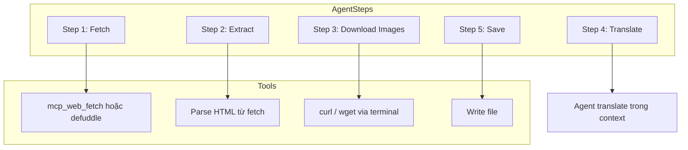

# Kế hoạch: Phát triển Skill Article Crawl Translate

## Mục tiêu

Tạo skill `article-crawl-translate` — file SKILL.md hướng dẫn agent (Cursor/Claude Code) thực hiện pipeline:

1. Fetch bài viết từ URL
2. Trích xuất nội dung chính (markdown)
3. Tải ảnh trong nội dung về local
4. Dịch nội dung sang tiếng Việt
5. Lưu markdown với link ảnh local

---

## Cấu trúc thư mục Skill

**Vị trí:** `skills/article-crawl-translate/` — trong chính project này (X.com).

Lý do: Lâu dài sẽ tạo thêm các skill khác hỗ trợ cùng, nên tổ chức skills trong project.

```
skills/
└── article-crawl-translate/
    ├── SKILL.md              # Main instructions (required)
    └── examples.md           # Optional: URL mẫu, output mẫu
```

---

## Kiến trúc Skill (Agent-Orchestrated)



Agent không dùng Python crawler — dùng tools có sẵn: `mcp_web_fetch`, `defuddle`, terminal, file write.

---

## Nội dung SKILL.md — Các Section Chính

### 1. Frontmatter

```yaml
---
name: article-crawl-translate
description: Use when the user wants to crawl a web article, translate it to Vietnamese, download content images, and save as markdown with local image links. Triggers on: crawl article, save article, dịch bài viết, tải bài về.
---
```

**CSO (Claude Search Optimization):** Description phải có trigger terms rõ ràng, không tóm tắt workflow.

### 2. Workflow Pattern — 5 Steps

| Step | Hành động | Tool / Cách |
|------|-----------|--------------|
| 1. Fetch | Lấy HTML từ URL | `mcp_web_fetch(url)` hoặc `defuddle parse url --json` (nếu cần HTML) |
| 2. Extract | Lấy markdown + danh sách ảnh | `defuddle parse url --md` cho markdown. Parse markdown để tìm `` patterns → list image URLs |
| 3. Download | Tải từng ảnh | `curl -o assets/img_01.png "https://..."` trong loop. Tạo `assets/` trong output folder |
| 4. Translate | Dịch nội dung | Agent dịch markdown sang tiếng Việt, giữ code blocks/URL, thay `` → `` |
| 5. Save | Ghi file | Write `article.md` vào `output/{slug}/` với frontmatter (title, source_url, translated_at) |

### 3. Chi tiết từng Step

**Step 1 — Fetch:**
- Dùng `mcp_web_fetch` nếu cần full HTML (để parse ảnh).
- Hoặc dùng `defuddle parse <url> --md -o temp.md` nếu defuddle có sẵn — markdown đã clean nhưng có thể mất URL ảnh gốc. Skill cần ghi rõ: nếu cần ảnh → fetch HTML rồi parse.

**Step 2 — Extract images:**
- Từ HTML: tìm tất cả `` trong main content (article, .post-content, .article-body).
- Loại trừ: data URI, icon nhỏ (width/height < 100), ảnh social/OG.
- Chuyển relative URL → absolute trước khi download.

**Step 3 — Download:**
- Tạo folder `output/{slug}/assets/`.
- Với mỗi URL ảnh: `curl -L -o assets/img_01.png "url"`.
- Đặt tên: `img_01.png`, `img_02.png` theo thứ tự xuất hiện trong bài.

**Step 4 — Translate:**
- Agent dịch toàn bộ markdown sang tiếng Việt.
- Giữ nguyên: code blocks, URL trong text, alt text ảnh (có thể dịch nếu phù hợp).
- Thay `` → ``.

**Step 5 — Save:**
- Ghi `article.md` với YAML frontmatter: `title`, `source_url`, `translated_at`, `lang: vi`
- Cấu trúc output: `output/{slug}/article.md`, `output/{slug}/assets/img_01.png`, ...

### 4. Output Format Template

```markdown
---
title: "[Tiếng Việt title]"
source_url: "https://..."
translated_at: "YYYY-MM-DD"
lang: vi
---

# [Tiêu đề đã dịch]

[Nội dung đã dịch, giữ cấu trúc heading/list/code]


```

### 5. Edge Cases — Cần Ghi trong Skill

| Case | Hướng dẫn agent |
|------|------------------|
| Ảnh lazy-load (`data-src`) | Parse cả `src` và `data-src` |
| URL relative | Resolve với base URL của trang |
| defuddle không có ảnh | Fallback: dùng mcp_web_fetch → parse HTML |
| Site chặn fetch | Thông báo user, gợi ý dùng browser copy |

### 6. Dependency Check

- **defuddle:** `npm install -g defuddle-cli` — nếu dùng.
- **curl:** Có sẵn trên macOS/Linux.

---

## Implementation Checklist

Dùng markdown checklist để theo dõi tiến độ khi implement:

### Phase 1: Cấu trúc

- [x] Tạo thư mục `skills/article-crawl-translate/`
- [x] Tạo file `skills/article-crawl-translate/SKILL.md`

### Phase 2: Nội dung SKILL.md

- [x] Viết frontmatter (name, description với trigger terms)
- [x] Viết section Overview
- [x] Viết workflow 5 steps (Fetch, Extract, Download, Translate, Save)
- [x] Thêm chi tiết từng step
- [x] Thêm Output Format Template
- [x] Thêm Edge Cases
- [x] Thêm Quick Reference (bảng tóm tắt tools/steps)
- [x] Thêm Common Mistakes

### Phase 3: Tài liệu bổ sung

- [x] Tạo `examples.md` (optional) — 1–2 URL mẫu + output mẫu ngắn

### Phase 4: Quality Check

- [x] Description dưới 500 chars, trigger terms rõ
- [x] SKILL.md dưới 500 dòng
- [x] Workflow có checklist/steps rõ ràng
- [x] Terminology nhất quán (fetch, extract, download, translate, save)
- [x] Không có đường dẫn Windows-style
- [x] File references one level deep

### Phase 5: Test

- [ ] Chạy scenario: "Crawl https://www.anthropic.com/engineering/building-effective-agents và dịch sang tiếng Việt"
- [ ] Kiểm tra output: article.md + assets/ có đúng format

---

## Xung đột với defuddle

Skill này **bổ sung** defuddle:
- defuddle: chỉ extract markdown từ URL.
- article-crawl-translate: full pipeline (fetch → extract → images → translate → save).

Skill có thể reference defuddle: "Nếu defuddle đã cài, dùng `defuddle parse url --md` cho bước extract; nếu cần ảnh, dùng mcp_web_fetch và parse HTML."
