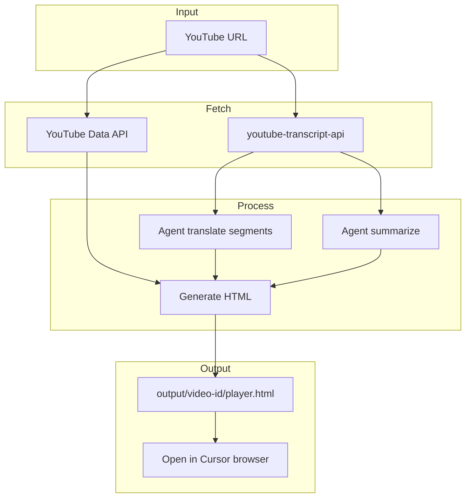

# Kế hoạch: YouTube Crawl Translate Skill

## Mục tiêu

Input: link YouTube. Output: trang HTML mở trong Cursor browser với:

- Video YouTube embed, play được
- Transcript sync theo thời gian phát (subtitle real-time)
- Bản dịch tiếng Việt sync cùng transcript
- Tóm tắt nội dung
- Comment nổi bật (theo likes/relevance)

---

## API Key và bảo mật

- **YOUTUBE_API_KEY** lưu trong file `.env` tại root project
- Scripts đọc key qua `python-dotenv` hoặc `os.environ.get('YOUTUBE_API_KEY')`
- **Bắt buộc:** Thêm `.env` vào `.gitignore` để tránh commit lên public repo
- Plan và code **không** chứa key thật — chỉ tham chiếu biến môi trường

---

## Kiến trúc tổng quan



---

## Cấu trúc thư mục

```
X.com/
├── .env                    # YOUTUBE_API_KEY (không commit)
├── .gitignore              # Chứa .env
├── plans/
│   └── youtube-crawl-translate-skill.md
├── skills/
│   └── youtube-crawl-translate/
│       ├── SKILL.md
│       ├── scripts/
│       │   ├── fetch_transcript.py
│       │   ├── fetch_comments.py
│       │   └── template.html
│       └── examples.md
└── output/
    └── {video_id}/
        └── player.html
```

---

## Chi tiết từng thành phần

### 1. Transcript (không cần API key)

Dùng [youtube-transcript-api](https://github.com/jdepoix/youtube-transcript-api):

```python
from youtube_transcript_api import YouTubeTranscriptApi
transcript = YouTubeTranscriptApi.get_transcript(video_id)
# Mỗi entry: {'text': '...', 'start': 0.0, 'duration': 4.5}
```

- Cài: `pip install youtube-transcript-api`
- Hỗ trợ auto-generated captions
- Trả về `start` và `duration` (giây) cho mỗi segment

### 2. Comments (cần YOUTUBE_API_KEY từ .env)

Dùng `google-api-python-client`, đọc key từ `.env`:

```python
from dotenv import load_dotenv
import os
load_dotenv()
api_key = os.environ.get('YOUTUBE_API_KEY')

from googleapiclient.discovery import build
youtube = build('youtube', 'v3', developerKey=api_key)
response = youtube.commentThreads().list(
    part='snippet',
    videoId=video_id,
    maxResults=50,
    order='relevance'
).execute()
```

- Key lấy từ `os.environ.get('YOUTUBE_API_KEY')` — giá trị trong `.env`
- Lấy comment nổi bật: `order='relevance'` hoặc sort theo `likeCount`
- Quota: 1 unit/call

### 3. HTML Player với Subtitle Sync

- YouTube IFrame API embed
- Polling `player.getCurrentTime()` mỗi 200–500ms
- Data: `transcriptSegments = [{start, duration, text, textVi}, ...]`
- Logic: với `currentTime`, tìm segment thỏa `start <= currentTime < start + duration`
- Hiển thị: 2 dòng — gốc + dịch — cập nhật theo segment hiện tại

### 4. Layout HTML đề xuất

```
+------------------------------------------+
|  YouTube Video (iframe embed)            |
+------------------------------------------+
|  Transcript (sync):                     |
|  [English text - current segment]        |
|  [Tiếng Việt - segment hiện tại]         |
+------------------------------------------+
|  Tóm tắt                                 |
|  [Summary text]                          |
+------------------------------------------+
|  Comment nổi bật                         |
|  - Comment 1 (author, likes, text)       |
|  - Comment 2 ...                         |
+------------------------------------------+
```

### 5. HTML Template — Agentic UI Style & UX

**Mục tiêu:** Trang HTML với phong cách agentic UI — sạch, hiện đại, thân thiện, hỗ trợ dark mode.

#### 5.1 Agentic UI Template Style

- **Aesthetic:** Giao diện gợi cảm giác AI assistant — card-based, spacing rộng, typography rõ ràng
- **Layout:** Single-column, max-width ~720px cho nội dung đọc, video full-width responsive
- **Hierarchy:** Video → Transcript (prominent) → Summary (collapsible) → Comments (scrollable list)
- **Feedback:** Transcript segment hiện tại có highlight (background/border), transition mượt khi đổi segment

#### 5.2 Dark Mode

- **Auto-detect:** Dùng `prefers-color-scheme: dark` để theo system preference
- **Toggle:** Nút chuyển light/dark, lưu preference trong `localStorage`
- **CSS variables:** Định nghĩa palette cho cả 2 mode:

```css
:root {
  --bg: #f8fafc;
  --surface: #ffffff;
  --text: #1e293b;
  --text-muted: #64748b;
  --accent: #3b82f6;
  --border: #e2e8f0;
}

[data-theme="dark"] {
  --bg: #0f172a;
  --surface: #1e293b;
  --text: #f1f5f9;
  --text-muted: #94a3b8;
  --accent: #60a5fa;
  --border: #334155;
}
```

#### 5.3 UI/UX Guidelines

| Nguyên tắc | Áp dụng |
|------------|---------|
| **Contrast** | Đảm bảo 4.5:1 cho text (WCAG AA) |
| **Typography** | Body 16px+, line-height 1.5–1.6, font sans-serif (system hoặc Google Fonts) |
| **Spacing** | Padding section 1.5–2rem, gap giữa transcript/dịch 0.5rem |
| **Touch targets** | Nút toggle theme, click segment ≥ 44px |
| **Focus states** | Visible focus ring cho keyboard nav |
| **Reduced motion** | `prefers-reduced-motion: reduce` → giảm transition |
| **Transcript area** | Min-height cố định để tránh layout jump khi đổi segment |

#### 5.4 Component Structure

```
┌─ Header (video title, theme toggle)
├─ Video container (16:9 aspect-ratio, responsive)
├─ Transcript card
│   ├─ Current segment (gốc) — highlight
│   └─ Current segment (dịch) — muted style
├─ Summary card (collapsible)
│   └─ Summary text
└─ Comments list
    └─ Comment card (avatar, author, likes, text)
```

#### 5.5 Font & Colors (đề xuất)

- **Font:** Inter hoặc Geist cho body; có thể dùng font khác cho heading
- **Light:** Nền #f8fafc, surface #fff, accent #3b82f6
- **Dark:** Nền #0f172a, surface #1e293b, accent #60a5fa

### 6. Translation

- Agent dịch từng segment transcript sang tiếng Việt
- Giữ format: mảng `[{start, duration, text, textVi}]`

---

## Workflow Skill (6 bước)

| Step | Hành động | Tool / Cách |
|------|-----------|-------------|
| 1 | Parse video ID từ URL | Regex: `(?:youtube.com/watch\?v=|youtu.be/)([a-zA-Z0-9_-]{11})` |
| 2 | Fetch transcript | `python scripts/fetch_transcript.py <video_id>` |
| 3 | Fetch comments | `python scripts/fetch_comments.py <video_id>` (đọc YOUTUBE_API_KEY từ .env) |
| 4 | Translate segments | Agent dịch từng segment |
| 5 | Summarize | Agent tóm tắt transcript |
| 6 | Generate HTML + open | Tạo player.html, `browser_navigate` tới file |

---

## Dependencies

```
youtube-transcript-api>=0.6.0
google-api-python-client>=2.100.0
python-dotenv>=1.0.0
```

---

## Edge Cases

| Case | Xử lý |
|------|-------|
| Video không có transcript | Thông báo user, bỏ qua sync; vẫn embed video + comments |
| Transcript disabled | Thử `YouTubeTranscriptApi.list_transcripts()` để chọn ngôn ngữ khác |
| API key không có / .env thiếu | Bỏ qua comments, vẫn tạo player với transcript + summary |
| Video private/deleted | Báo lỗi rõ ràng |

---

## Implementation Checklist

### Phase 1: Setup

- [x] Tạo `.env` với `YOUTUBE_API_KEY=...` (không commit)
- [x] Tạo `.gitignore` và thêm `.env`
- [x] Tạo `requirements.txt` với dependencies

### Phase 2: Scripts

- [x] Script `fetch_transcript.py` — extract transcript với timestamps (retry + yt-dlp fallback + --cookies-from-browser)
- [x] Script `fetch_comments.py` — fetch comments, đọc key từ `.env`

### Phase 3: HTML Template (Agentic UI)

- [x] HTML structure — video, transcript, summary, comments sections
- [x] CSS variables — light/dark palette, typography
- [x] Dark mode — `prefers-color-scheme` + toggle, `localStorage`
- [x] Subtitle sync — polling `getCurrentTime()`, highlight current segment
- [x] UX polish — contrast, spacing, focus states, reduced-motion
- [x] Responsive — max-width, 16:9 video, mobile-friendly

### Phase 4: Skill

- [x] SKILL.md — workflow 6 bước, hướng dẫn agent

### Phase 5: Test

- [x] Chạy với 1 video mẫu (mock data: `output/test-video/player.html`)
- [ ] Kiểm tra transcript thật (cần cookies nếu YouTube chặn bot)
